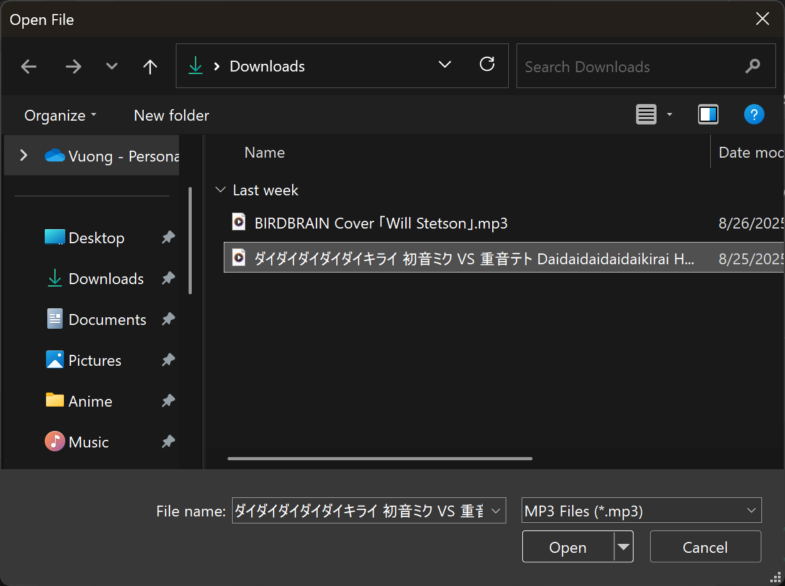
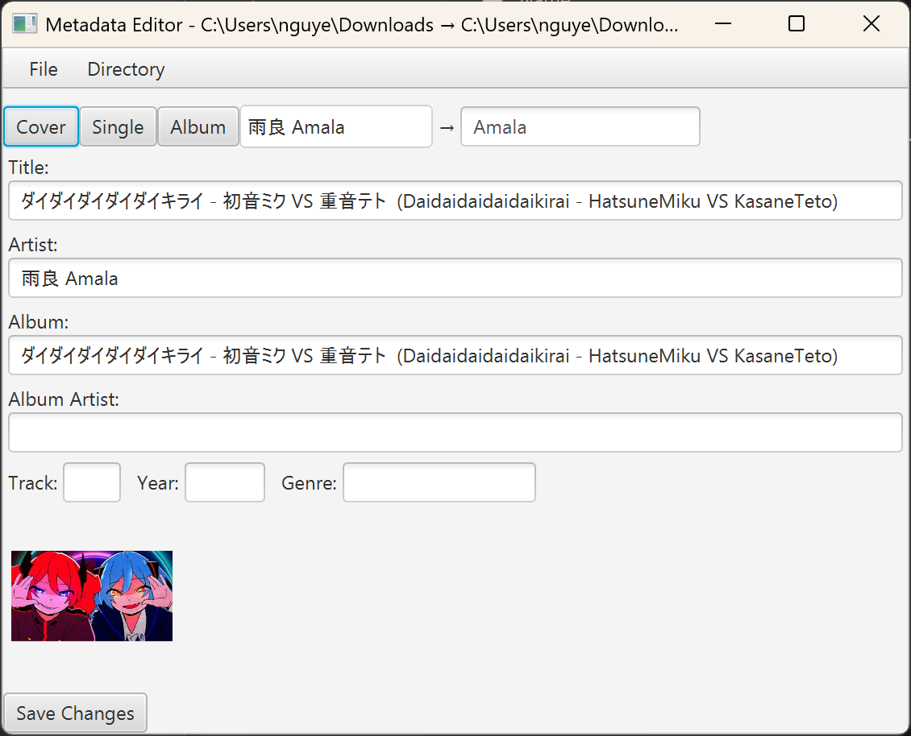
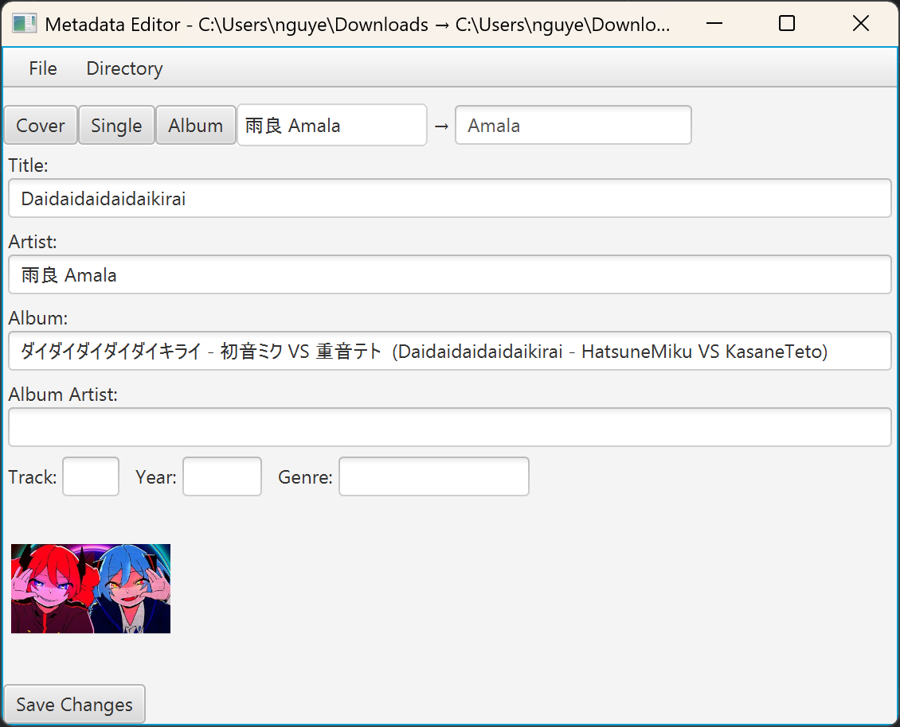
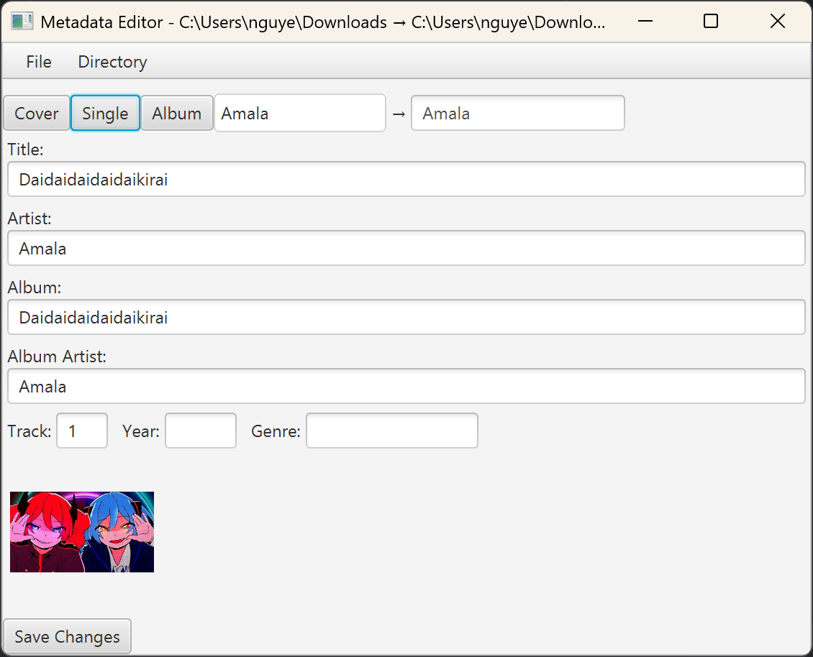
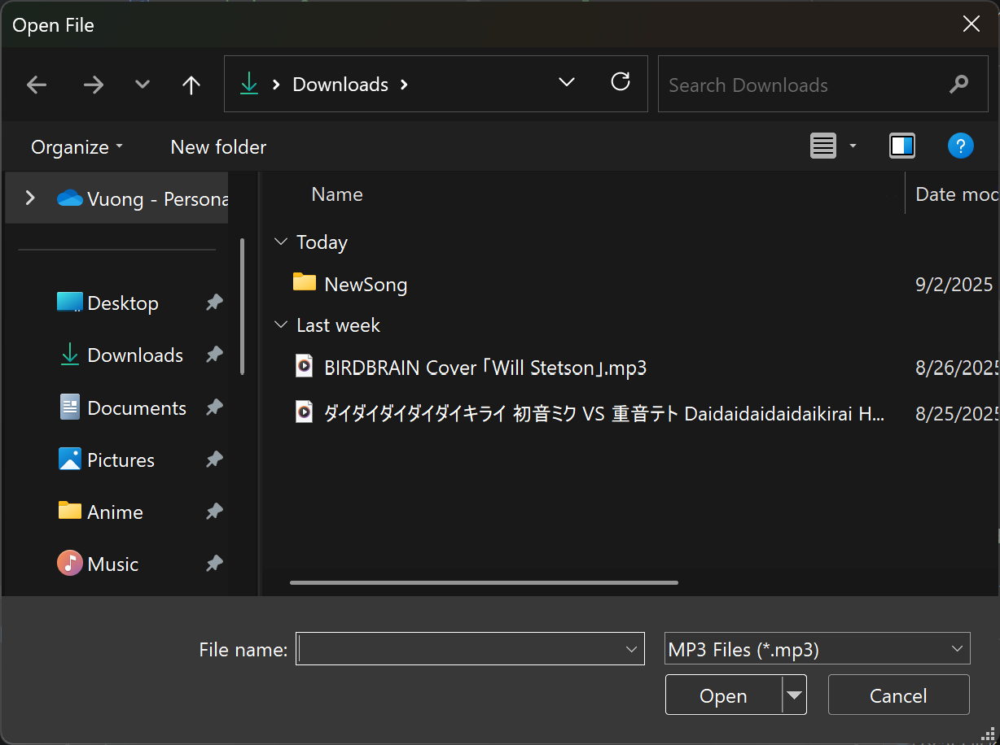
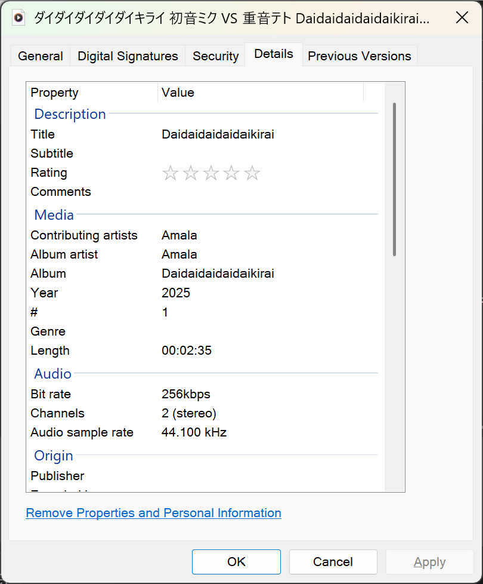
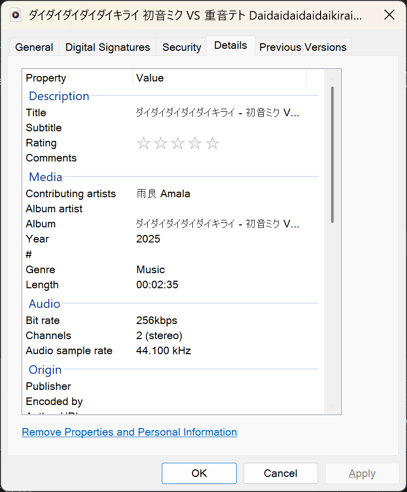
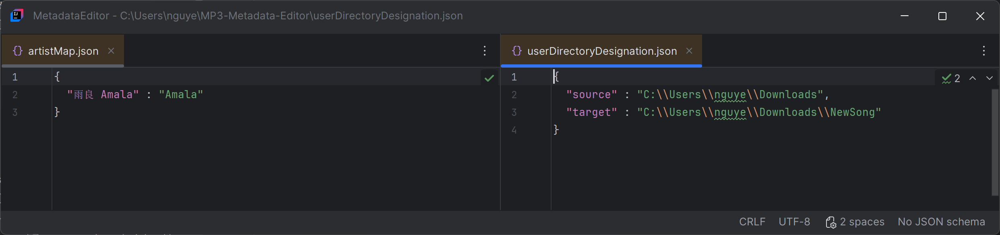

A personal program based on Mp3tag, which is designed for editing the metadata of MP3 files.

## Functionality:
- Editing title, artist, album, album artist, track number, year, and cover image metadata of mp3 files.
- Shortcuts for quickly auto-filling information.
- Saves to a new file.

## Demo:

Opens File Explorer in app and displays metadata. Source and target directories are displayed in the window title, and can be changed in the directory menu.
     
    
    

    After editing title, using the shortcut button [Single] automatically updates all fields. All other buttons function similarly.
     
    
    

    The app saves to the target directory (default is newSong within the user's download folder). Here is the difference the updated song (former) vs. the original (latter).
     
    
    
    

    This app saves persistent data within jsons, which the user can change within the app. This was done using the Java module Jackson.
     
    

# Full Functionality Description:
## Menus
- The bar at the top of the app provides the main file handling.
- File -> New File:
  - Selects a new file to edit.
- Directory -> Source/Target Directory:
  - Selects a directory to get/put files.
  - Should both directories be the same, the new file will have " (1)" in its name.

## Metadata
- This app give the user access to edit the title, artist, album, album artist, track number, year, genre, and album image of a selected mp3 file.
- Should the artist have characters or a different name, the user can enter a new username next to the Quick Fill buttons to change the name in the future.
  - A preview of the conversion will be in the textbox after the arrow.
- The album image can be changed by dragging a .png or .jpg file over it.

### Quick Fill Buttons
- These buttons automatically fill multiple fields based on given fields.
- <b>Cover:</b>
  - Album = Artist + " Covers"
  - Album Artist = Artist
- <b>Single:</b>
  - Album = Title
  - Album Artist = Artist
  - Track = 1
- <b>Album:</b>
  - Album Artist = Artist

## Persistent Data
- This app will create a folder called "MP3-Metadata-Editor" in the directory "C:\Users\your_user\MP3-Metadata-Editor"
- This directory will be populated with "artistMap.json" and "userDirectoryDesignation.json".
- <b>artistMap.json</b>
  - Holds a map for artist conversion.
- <b>userDirectoryDesignation.json</b>
  - Holds the source and target directories.
